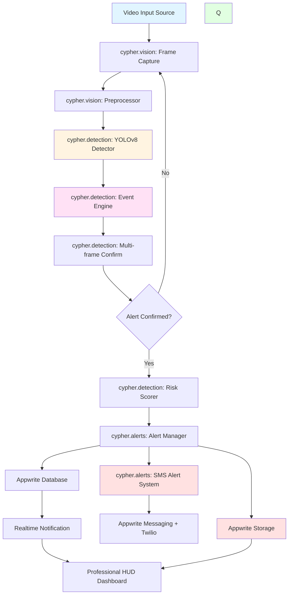
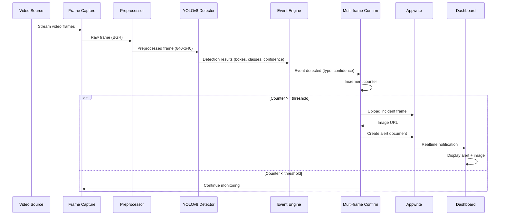
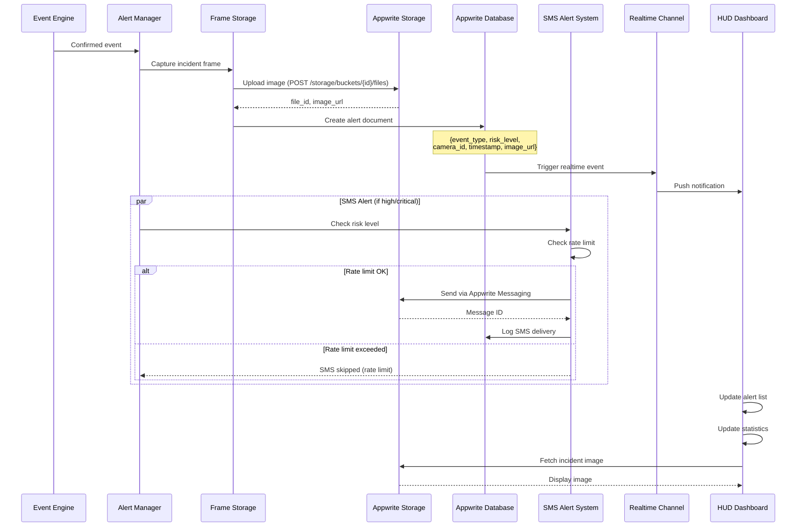
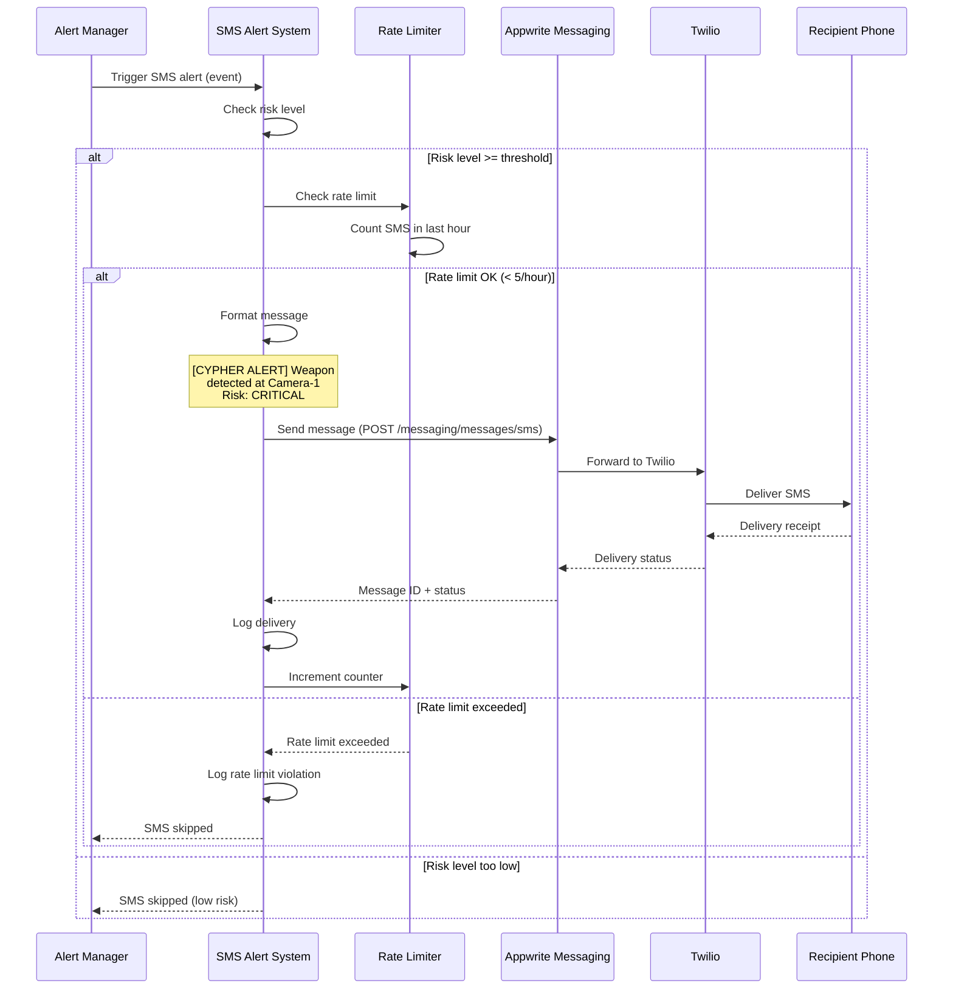
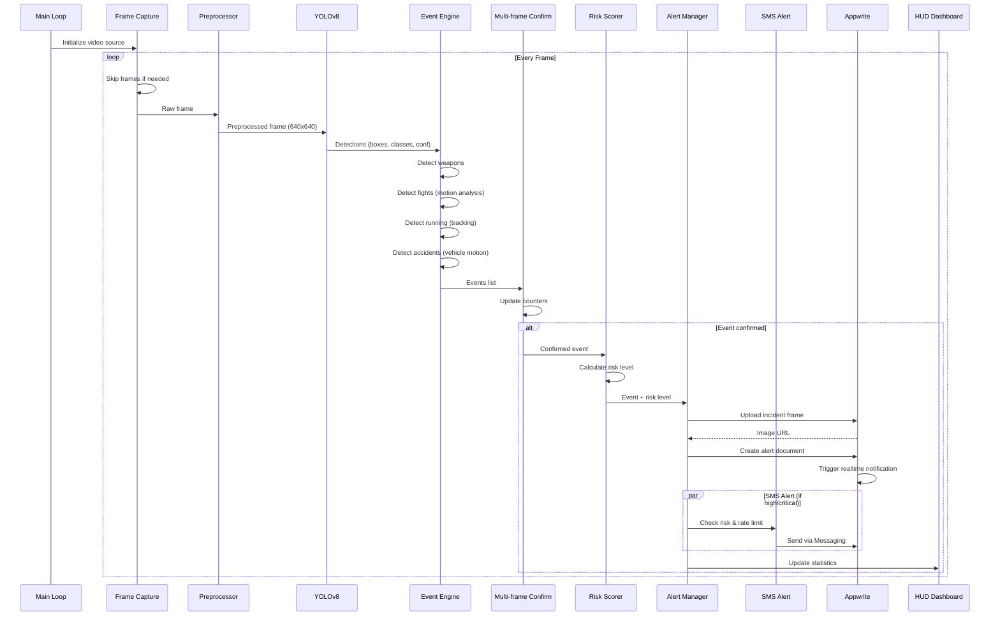

# Design Document: CYPHER - AI Surveillance Intelligence System

## Overview

CYPHER (AI Surveillance Intelligence System) is a professional hackathon prototype that provides real-time threat detection from video feeds using computer vision and deep learning. The system processes video streams (webcam, CCTV, or video files) to detect four critical event types: weapon presence (knife/gun), physical altercations (fights), suspicious running behavior, and vehicle accidents. Built with Python, OpenCV, and YOLOv8 for detection, FastAPI for the backend API, and Appwrite for data persistence, real-time notifications, and SMS alerts, the system implements multi-frame confirmation logic to reduce false positives.

The system features a professional HUD interface with cyberpunk/tech aesthetic, SMS emergency notifications via Appwrite Messaging (Twilio), and a modular architecture with clear separation of concerns. The tagline "Real-time Threat Detection Powered by AI" emphasizes the system's intelligent monitoring capabilities.

The architecture prioritizes demo-readiness and professional presentation for hackathon judges while maintaining clean code structure and extensibility.

## Architecture




## Sequence Diagrams

### Main Detection Flow



### Alert Creation Flow



### SMS Alert Flow




## Components and Interfaces

### Component 1: Frame Capture Module

**Purpose**: Captures video frames from various sources (webcam, CCTV stream, video file) and manages frame rate control.

**Interface**:
```python
class FrameCapture:
    def __init__(self, source: str, skip_frames: int = 2):
        """Initialize video capture from source"""
        pass
    
    def read_frame(self) -> tuple[bool, np.ndarray]:
        """Read next frame, returns (success, frame)"""
        pass
    
    def release(self) -> None:
        """Release video capture resources"""
        pass
    
    def get_fps(self) -> float:
        """Get source FPS"""
        pass
```

**Responsibilities**:
- Initialize OpenCV VideoCapture with source
- Implement frame skipping for performance optimization
- Handle video source errors and reconnection
- Provide frame metadata (timestamp, frame number)

### Component 2: Frame Preprocessor

**Purpose**: Prepares raw frames for YOLOv8 inference by resizing, normalizing, and converting color spaces.

**Interface**:
```python
class FramePreprocessor:
    def __init__(self, target_size: tuple[int, int] = (640, 640)):
        """Initialize preprocessor with target dimensions"""
        pass
    
    def preprocess(self, frame: np.ndarray) -> np.ndarray:
        """Resize and normalize frame for YOLO input"""
        pass
    
    def denormalize_coords(self, boxes: np.ndarray, original_shape: tuple) -> np.ndarray:
        """Convert detection boxes back to original frame coordinates"""
        pass
```

**Responsibilities**:
- Resize frames to 640x640 for YOLOv8n
- Maintain aspect ratio with letterboxing
- Convert BGR to RGB if needed
- Store original dimensions for coordinate mapping

### Component 3: YOLOv8 Object Detector

**Purpose**: Performs object detection using Ultralytics YOLOv8n model to identify persons, weapons, and vehicles.

**Interface**:
```python
class YOLODetector:
    def __init__(self, model_path: str = "yolov8n.pt", confidence: float = 0.5):
        """Load YOLOv8 model"""
        pass
    
    def detect(self, frame: np.ndarray) -> list[Detection]:
        """Run inference and return detections"""
        pass
    
    def filter_classes(self, detections: list[Detection], classes: list[str]) -> list[Detection]:
        """Filter detections by class names"""
        pass
```

**Detection Data Model**:
```python
@dataclass
class Detection:
    bbox: tuple[float, float, float, float]  # x1, y1, x2, y2
    confidence: float
    class_id: int
    class_name: str
```

**Responsibilities**:
- Load YOLOv8n model weights
- Run inference on preprocessed frames
- Filter detections by confidence threshold
- Return structured detection results


### Component 4: Event Detection Engine

**Purpose**: Analyzes YOLO detections and frame motion to identify security events (weapons, fights, running, accidents).

**Interface**:
```python
class EventDetectionEngine:
    def __init__(self, config: EventConfig):
        """Initialize with detection thresholds and parameters"""
        pass
    
    def detect_weapon(self, detections: list[Detection]) -> Optional[WeaponEvent]:
        """Detect knife or gun in detections"""
        pass
    
    def detect_fight(self, detections: list[Detection], frame: np.ndarray, prev_frame: np.ndarray) -> Optional[FightEvent]:
        """Detect fight based on person proximity and motion"""
        pass
    
    def detect_suspicious_running(self, detections: list[Detection], frame_delta: float) -> Optional[RunningEvent]:
        """Detect rapid person movement"""
        pass
    
    def detect_accident(self, detections: list[Detection], frame: np.ndarray, prev_frame: np.ndarray) -> Optional[AccidentEvent]:
        """Detect vehicle collision or sudden stop"""
        pass
    
    def process_frame(self, detections: list[Detection], frame: np.ndarray, prev_frame: np.ndarray) -> list[Event]:
        """Process all detection types and return events"""
        pass
```

**Event Data Models**:
```python
@dataclass
class Event:
    event_type: str  # "weapon", "fight", "running", "accident"
    confidence: float
    timestamp: datetime
    bbox: Optional[tuple[float, float, float, float]]
    metadata: dict

@dataclass
class WeaponEvent(Event):
    weapon_type: str  # "knife" or "gun"

@dataclass
class FightEvent(Event):
    person_count: int
    motion_intensity: float

@dataclass
class RunningEvent(Event):
    person_id: int
    speed: float  # pixels per second

@dataclass
class AccidentEvent(Event):
    vehicle_count: int
    impact_severity: float
```

**Responsibilities**:
- Implement weapon detection logic (knife/gun classes)
- Calculate motion intensity for fight detection
- Track person centroids for running detection
- Detect vehicle motion anomalies for accidents
- Return structured event objects with metadata

### Component 5: Multi-frame Confirmation System

**Purpose**: Reduces false positives by requiring events to persist across multiple consecutive frames before triggering alerts.

**Interface**:
```python
class MultiFrameConfirmation:
    def __init__(self, thresholds: dict[str, int]):
        """Initialize with frame count thresholds per event type"""
        pass
    
    def update(self, events: list[Event]) -> list[ConfirmedEvent]:
        """Update counters and return confirmed events"""
        pass
    
    def reset_counter(self, event_type: str) -> None:
        """Reset counter for specific event type"""
        pass
    
    def get_counter(self, event_type: str) -> int:
        """Get current counter value"""
        pass
```

**Responsibilities**:
- Maintain separate counters for each event type
- Increment counter when event detected
- Reset counter to 0 when event not detected
- Confirm alert when counter reaches threshold (e.g., 5 frames for weapons)
- Return only confirmed events


### Component 6: Risk Scorer

**Purpose**: Assigns risk levels (low, medium, high, critical) to confirmed events based on event type and confidence.

**Interface**:
```python
class RiskScorer:
    def calculate_risk(self, event: Event) -> str:
        """Calculate risk level for event"""
        pass
    
    def get_priority(self, risk_level: str) -> int:
        """Get numeric priority for sorting"""
        pass
```

**Risk Level Rules**:
- Weapon (gun): CRITICAL
- Weapon (knife): HIGH
- Fight: HIGH
- Accident: HIGH
- Suspicious Running: MEDIUM

**Responsibilities**:
- Map event types to risk levels
- Consider confidence scores in risk calculation
- Provide consistent risk categorization

### Component 7: Appwrite Client

**Purpose**: Manages all interactions with Appwrite backend (storage, database, realtime).

**Interface**:
```python
class AppwriteClient:
    def __init__(self, endpoint: str, project_id: str, api_key: str):
        """Initialize Appwrite SDK clients"""
        pass
    
    def upload_image(self, image_data: bytes, filename: str) -> tuple[str, str]:
        """Upload incident frame, returns (file_id, image_url)"""
        pass
    
    def create_alert(self, alert_data: dict) -> str:
        """Create alert document, returns document_id"""
        pass
    
    def get_alerts(self, limit: int = 50) -> list[dict]:
        """Retrieve recent alerts"""
        pass
    
    def subscribe_realtime(self, callback: Callable) -> None:
        """Subscribe to realtime alert updates"""
        pass
```

**Alert Document Schema**:
```python
{
    "event_type": str,      # "weapon", "fight", "running", "accident"
    "risk_level": str,      # "low", "medium", "high", "critical"
    "camera_id": str,       # Camera identifier
    "timestamp": str,       # ISO 8601 timestamp
    "image_url": str,       # Appwrite storage URL
    "confidence": float,    # Detection confidence
    "metadata": dict        # Event-specific metadata
}
```

**Responsibilities**:
- Initialize Appwrite SDK (Storage, Database, Realtime)
- Upload incident frames to Appwrite Storage bucket
- Create alert documents in Database collection
- Provide realtime subscription interface
- Handle Appwrite API errors and retries

### Component 8: FastAPI Backend

**Purpose**: Provides REST API endpoints for video processing control and alert retrieval.

**Interface**:
```python
@app.post("/api/start")
async def start_surveillance(config: SurveillanceConfig) -> dict:
    """Start surveillance on video source"""
    pass

@app.post("/api/stop")
async def stop_surveillance() -> dict:
    """Stop active surveillance"""
    pass

@app.get("/api/alerts")
async def get_alerts(limit: int = 50) -> list[dict]:
    """Get recent alerts"""
    pass

@app.get("/api/status")
async def get_status() -> dict:
    """Get surveillance system status"""
    pass
```

**Responsibilities**:
- Expose REST API for surveillance control
- Manage surveillance process lifecycle
- Provide alert query endpoints
- Handle CORS for frontend access
- Stream processing status updates


### Component 9: Professional HUD Dashboard

**Purpose**: Modern, sleek dashboard with cyberpunk/tech aesthetic for real-time monitoring with professional visual effects.

**Interface**:
```javascript
class CypherHUD {
    constructor(apiEndpoint, appwriteEndpoint) {
        // Initialize HUD with API endpoints
    }
    
    async loadAlerts() {
        // Fetch and display recent alerts
    }
    
    subscribeToRealtime() {
        // Subscribe to Appwrite realtime for new alerts
    }
    
    displayAlert(alert) {
        // Add alert to UI with animated threat indicators
    }
    
    updateStatistics(stats) {
        // Update live stats panel (threats detected, uptime, FPS)
    }
    
    renderVideoFeed(frame) {
        // Display video feed with detection overlays
    }
    
    animateThreatIndicator(alert) {
        // Show animated bounding boxes and threat indicators
    }
    
    updateThreatLevel(level) {
        // Update color-coded threat level with glowing effects
    }
}
```

**UI Components**:
- Video feed panel with real-time detection overlays
- Animated threat indicators with bounding boxes
- Live statistics panel:
  - Total threats detected (by type)
  - System uptime
  - Current FPS
  - Active camera count
- Color-coded threat levels with glowing effects:
  - CRITICAL (red glow) - Weapons (gun)
  - HIGH (orange glow) - Weapons (knife), fights, accidents
  - MEDIUM (yellow glow) - Suspicious running
- Alert timeline with scrollable history
- Professional typography (monospace for data, sans-serif for labels)
- Dark theme with neon accents (cyan, magenta, yellow)
- Smooth CSS animations and transitions
- Responsive grid layout

**Visual Design Elements**:
- Cyberpunk-inspired color palette (#00ffff, #ff00ff, #ffff00, #1a1a2e)
- Glowing borders and shadows for active elements
- Animated scanlines effect (optional)
- Pulsing threat indicators
- Smooth fade-in animations for new alerts
- Gradient backgrounds for panels
- Icon-based event type indicators

**Responsibilities**:
- Display real-time video feed with detection overlays
- Render animated threat indicators and bounding boxes
- Update live statistics (threats, uptime, FPS)
- Show color-coded threat levels with visual effects
- Provide professional, demo-ready interface for judges
- Handle UI state management and animations
- Subscribe to realtime updates
- Maintain responsive layout

### Component 10: SMS Alert System

**Purpose**: Emergency SMS notifications for critical/high alerts using Appwrite Messaging with Twilio integration.

**Interface**:
```python
class SMSAlertSystem:
    def __init__(self, appwrite_client: AppwriteClient, config: SMSConfig):
        """Initialize SMS system with Appwrite Messaging"""
        pass
    
    def send_sms_alert(self, alert: Alert, recipients: list[str]) -> bool:
        """Send SMS notification to recipients"""
        pass
    
    def format_sms_message(self, alert: Alert) -> str:
        """Format alert as SMS message"""
        pass
    
    def check_rate_limit(self) -> bool:
        """Check if rate limit allows sending SMS"""
        pass
    
    def track_delivery_status(self, message_id: str) -> str:
        """Track SMS delivery status"""
        pass
    
    def get_sms_history(self, limit: int = 50) -> list[dict]:
        """Retrieve SMS delivery history"""
        pass
```

**SMS Message Format**:
```
[CYPHER ALERT] {event_type} detected at {camera_id} - {timestamp}
Risk: {risk_level}
View: {dashboard_url}
```

**Example SMS Messages**:
- `[CYPHER ALERT] Weapon (gun) detected at Camera-1 - 2024-01-15 14:30:45 Risk: CRITICAL View: https://cypher.app/alerts/abc123`
- `[CYPHER ALERT] Fight detected at Camera-2 - 2024-01-15 14:32:10 Risk: HIGH View: https://cypher.app/alerts/def456`

**Configuration**:
```python
@dataclass
class SMSConfig:
    enabled: bool = True
    recipients: list[str] = field(default_factory=list)  # Phone numbers
    min_risk_level: str = "high"  # Only send for high/critical
    rate_limit_per_hour: int = 5  # Max 5 SMS per hour
    twilio_provider_id: str = ""  # Appwrite Messaging provider ID
    include_dashboard_link: bool = True
```

**Appwrite Messaging Setup**:
- Create Twilio provider in Appwrite Console
- Configure Twilio credentials (Account SID, Auth Token, Phone Number)
- Create messaging topic for alert notifications
- Subscribe recipient phone numbers to topic

**Rate Limiting**:
- Maximum 5 SMS per hour to prevent spam
- Track sent messages with timestamps
- Reset counter every hour
- Log rate limit violations

**Responsibilities**:
- Send SMS notifications for critical/high alerts
- Format alert data as concise SMS message
- Integrate with Appwrite Messaging service
- Implement rate limiting (max 5 per hour)
- Track SMS delivery status
- Manage recipient phone numbers
- Provide SMS history for auditing

### Component 11: Alert Manager

**Purpose**: Centralized alert management coordinating SMS alerts, database storage, and realtime notifications.

**Interface**:
```python
class AlertManager:
    def __init__(
        self,
        appwrite_client: AppwriteClient,
        sms_system: SMSAlertSystem,
        config: AlertConfig
    ):
        """Initialize alert manager with alert systems"""
        pass
    
    def process_confirmed_alert(self, event: Event, frame: np.ndarray) -> str:
        """Process confirmed event and trigger all alert systems"""
        pass
    
    def upload_incident_frame(self, frame: np.ndarray, event: Event) -> tuple[str, str]:
        """Upload incident frame to storage"""
        pass
    
    def create_alert_document(self, alert_data: dict) -> str:
        """Create alert in database"""
        pass
    
    def trigger_sms_alert(self, alert: Alert) -> None:
        """Trigger SMS alert if conditions met"""
        pass
    
    def get_alert_statistics(self) -> dict:
        """Get alert statistics for dashboard"""
        pass
```

**Alert Processing Flow**:
1. Receive confirmed event from multi-frame confirmation
2. Calculate risk level
3. Upload incident frame to Appwrite Storage
4. Create alert document in Appwrite Database
5. Trigger SMS alert (if risk level >= threshold and rate limit allows)
6. Realtime notification automatically sent by Appwrite
7. Update alert statistics

**Configuration**:
```python
@dataclass
class AlertConfig:
    sms_enabled: bool = True
    sms_min_risk_level: str = "high"
    store_incident_frames: bool = True
    image_quality: int = 85  # JPEG quality
    max_alerts_per_minute: int = 10
```

**Responsibilities**:
- Coordinate SMS alerts, database storage, and realtime notifications
- Upload incident frames to storage
- Create alert documents in database
- Trigger SMS alerts for high/critical events
- Track alert statistics
- Enforce rate limiting across all alert types
- Provide unified alert processing interface

### Component 12: Modular Package Structure

**Purpose**: Professional package structure with clear separation of concerns and clean interfaces.

**Package Structure**:
```
cypher/
├── __init__.py
├── detection/
│   ├── __init__.py
│   ├── detector.py          # YOLOv8 detector
│   ├── event_engine.py      # Event detection logic
│   ├── confirmation.py      # Multi-frame confirmation
│   ├── risk_scorer.py       # Risk level calculation
│   └── models.py            # Detection data models
├── alerts/
│   ├── __init__.py
│   ├── manager.py           # Alert manager
│   ├── sms.py               # SMS alert system
│   └── models.py            # Alert data models
├── vision/
│   ├── __init__.py
│   ├── capture.py           # Frame capture
│   ├── preprocessor.py      # Frame preprocessing
│   └── utils.py             # Vision utilities
├── api/
│   ├── __init__.py
│   ├── main.py              # FastAPI app
│   ├── routes.py            # API endpoints
│   └── models.py            # API request/response models
├── config/
│   ├── __init__.py
│   ├── settings.py          # Configuration management
│   └── constants.py         # System constants
└── utils/
    ├── __init__.py
    ├── logging.py           # Structured logging
    ├── appwrite_client.py   # Appwrite integration
    └── helpers.py           # Shared utilities
```

**Module Interfaces**:

**cypher.detection**:
- Exports: `YOLODetector`, `EventDetectionEngine`, `MultiFrameConfirmation`, `RiskScorer`
- Dependencies: `cypher.vision`, `cypher.config`

**cypher.alerts**:
- Exports: `AlertManager`, `SMSAlertSystem`
- Dependencies: `cypher.utils`, `cypher.config`

**cypher.vision**:
- Exports: `FrameCapture`, `FramePreprocessor`
- Dependencies: `opencv-python`, `numpy`

**cypher.api**:
- Exports: `app` (FastAPI instance)
- Dependencies: `cypher.detection`, `cypher.alerts`, `cypher.vision`, `cypher.config`

**cypher.config**:
- Exports: `Settings`, `EventConfig`, `SMSConfig`, `AlertConfig`
- Dependencies: `pydantic`, `python-dotenv`

**cypher.utils**:
- Exports: `AppwriteClient`, `setup_logging`, `format_timestamp`
- Dependencies: `appwrite`, `logging`

**Dependency Injection**:
```python
# Example: Injecting dependencies for testability
class SurveillanceSystem:
    def __init__(
        self,
        detector: YOLODetector,
        event_engine: EventDetectionEngine,
        alert_manager: AlertManager,
        config: Settings
    ):
        self.detector = detector
        self.event_engine = event_engine
        self.alert_manager = alert_manager
        self.config = config
```

**Logging**:
```python
# Structured logging with JSON output
import logging
from cypher.utils.logging import setup_logging

logger = setup_logging("cypher.detection")
logger.info("weapon_detected", extra={
    "event_type": "weapon",
    "weapon_type": "gun",
    "confidence": 0.92,
    "camera_id": "camera_1"
})
```

**Responsibilities**:
- Provide clear module boundaries
- Enable dependency injection for testing
- Support professional code organization
- Facilitate team collaboration
- Enable easy feature additions
- Provide consistent logging interface
- Support configuration management

### Component 9 (Updated): Dashboard Frontend

**Purpose**: Simple HTML/JavaScript interface for monitoring live alerts and viewing incident images.

**Interface**:
```javascript
class Dashboard {
    constructor(apiEndpoint, appwriteEndpoint) {
        // Initialize dashboard with API endpoints
    }
    
    async loadAlerts() {
        // Fetch and display recent alerts
    }
    
    subscribeToRealtime() {
        // Subscribe to Appwrite realtime for new alerts
    }
    
    displayAlert(alert) {
        // Add alert to UI with incident image
    }
    
    showIncidentImage(imageUrl) {
        // Display full incident image in modal
    }
}
```

**UI Components**:
- Alert list (scrollable, newest first)
- Alert card (event type, risk badge, timestamp, thumbnail)
- Image modal (full incident frame view)
- Status indicator (system running/stopped)
- Filter controls (by event type, risk level)

**Responsibilities**:
- Display real-time alert feed
- Show incident images from Appwrite Storage
- Subscribe to Appwrite realtime updates
- Provide alert filtering and sorting
- Handle UI state management

## Data Models

### Detection Configuration

```python
@dataclass
class EventConfig:
    weapon_confidence_threshold: float = 0.75
    weapon_frame_threshold: int = 5
    fight_motion_threshold: float = 50.0
    fight_proximity_threshold: float = 100.0  # pixels
    fight_frame_threshold: int = 10
    running_speed_threshold: float = 200.0  # pixels per second
    running_frame_threshold: int = 8
    accident_motion_spike_threshold: float = 100.0
    accident_frame_threshold: int = 5
```

**Validation Rules**:
- All confidence thresholds must be between 0.0 and 1.0
- All frame thresholds must be positive integers
- Motion and speed thresholds must be positive floats

### SMS Alert Configuration

```python
@dataclass
class SMSConfig:
    enabled: bool = True
    recipients: list[str] = field(default_factory=list)  # Phone numbers in E.164 format
    min_risk_level: str = "high"  # Only send for high/critical
    rate_limit_per_hour: int = 5  # Max 5 SMS per hour
    twilio_provider_id: str = ""  # Appwrite Messaging provider ID
    include_dashboard_link: bool = True
    dashboard_url: str = "https://cypher.app"
```

**Validation Rules**:
- recipients must be valid E.164 phone numbers (e.g., +1234567890)
- min_risk_level must be one of: "low", "medium", "high", "critical"
- rate_limit_per_hour must be positive integer (1-10 recommended)
- twilio_provider_id must be non-empty string if SMS enabled
- dashboard_url must be valid URL

### Alert Manager Configuration

```python
@dataclass
class AlertConfig:
    sms_enabled: bool = True
    sms_min_risk_level: str = "high"
    store_incident_frames: bool = True
    image_quality: int = 85  # JPEG quality (1-100)
    max_alerts_per_minute: int = 10
    alert_retention_days: int = 7  # Auto-delete old alerts
```

**Validation Rules**:
- image_quality must be between 1 and 100
- max_alerts_per_minute must be positive integer
- alert_retention_days must be positive integer

### HUD Statistics Model

```python
@dataclass
class HUDStatistics:
    total_threats: int
    threats_by_type: dict[str, int]  # {"weapon": 5, "fight": 2, ...}
    system_uptime_seconds: float
    current_fps: float
    active_cameras: int
    last_alert_timestamp: Optional[datetime]
    alerts_last_hour: int
```

**Validation Rules**:
- All counts must be non-negative integers
- current_fps must be non-negative float
- system_uptime_seconds must be non-negative float

### SMS Delivery Status Model

```python
@dataclass
class SMSDeliveryStatus:
    message_id: str
    recipient: str
    status: str  # "queued", "sent", "delivered", "failed"
    sent_at: datetime
    delivered_at: Optional[datetime]
    error_message: Optional[str]
```

**Validation Rules**:
- status must be one of: "queued", "sent", "delivered", "failed"
- sent_at must be valid datetime
- delivered_at must be after sent_at if present

### Alert Document

```python
@dataclass
class AlertDocument:
    event_type: str
    risk_level: str
    camera_id: str
    timestamp: datetime
    image_url: str
    confidence: float
    metadata: dict
    
    def to_dict(self) -> dict:
        """Convert to Appwrite document format"""
        return {
            "event_type": self.event_type,
            "risk_level": self.risk_level,
            "camera_id": self.camera_id,
            "timestamp": self.timestamp.isoformat(),
            "image_url": self.image_url,
            "confidence": self.confidence,
            "metadata": json.dumps(self.metadata)
        }
```

**Validation Rules**:
- event_type must be one of: "weapon", "fight", "running", "accident"
- risk_level must be one of: "low", "medium", "high", "critical"
- camera_id must be non-empty string
- timestamp must be valid ISO 8601 format
- confidence must be between 0.0 and 1.0
- image_url must be valid Appwrite storage URL


## Main Algorithm/Workflow



## Key Functions with Formal Specifications

### Function 1: detect_weapon()

```python
def detect_weapon(detections: list[Detection], confidence_threshold: float) -> Optional[WeaponEvent]:
    """Detect weapons (knife/gun) in YOLO detections"""
    pass
```

**Preconditions:**
- `detections` is a valid list (may be empty)
- `confidence_threshold` is between 0.0 and 1.0
- Each detection in list has valid `class_name` and `confidence` attributes

**Postconditions:**
- Returns `WeaponEvent` if weapon detected with confidence >= threshold
- Returns `None` if no weapon detected or confidence too low
- If returned, `WeaponEvent.weapon_type` is either "knife" or "gun"
- If returned, `WeaponEvent.confidence` >= `confidence_threshold`
- No mutations to input `detections` list

**Loop Invariants:** N/A (single pass through detections)

### Function 2: detect_fight()

```python
def detect_fight(
    detections: list[Detection], 
    frame: np.ndarray, 
    prev_frame: np.ndarray,
    motion_threshold: float,
    proximity_threshold: float
) -> Optional[FightEvent]:
    """Detect fight based on person proximity and motion intensity"""
    pass
```

**Preconditions:**
- `detections` contains only "person" class detections
- `frame` and `prev_frame` are valid numpy arrays with same shape
- `motion_threshold` and `proximity_threshold` are positive floats
- At least 2 persons detected for fight to be possible

**Postconditions:**
- Returns `FightEvent` if conditions met: >= 2 persons close together AND high motion
- Returns `None` if < 2 persons or motion/proximity below thresholds
- If returned, `FightEvent.person_count` >= 2
- If returned, `FightEvent.motion_intensity` >= `motion_threshold`
- No mutations to input frames or detections

**Loop Invariants:**
- For person proximity loop: All previously checked person pairs maintain their distance calculations
- For motion calculation: Frame difference accumulator increases monotonically


### Function 3: detect_suspicious_running()

```python
def detect_suspicious_running(
    detections: list[Detection],
    prev_detections: list[Detection],
    time_delta: float,
    speed_threshold: float
) -> Optional[RunningEvent]:
    """Detect rapid person movement indicating suspicious running"""
    pass
```

**Preconditions:**
- `detections` and `prev_detections` contain only "person" class detections
- `time_delta` is positive float (seconds between frames)
- `speed_threshold` is positive float (pixels per second)
- Person tracking IDs are consistent between frames

**Postconditions:**
- Returns `RunningEvent` if person displacement/time_delta >= speed_threshold
- Returns `None` if no person exceeds speed threshold
- If returned, `RunningEvent.speed` >= `speed_threshold`
- If returned, `RunningEvent.person_id` is valid tracking ID
- No mutations to input detections

**Loop Invariants:**
- For person tracking loop: All previously matched persons maintain their ID associations
- Speed calculations remain consistent with time_delta throughout iteration

### Function 4: multi_frame_update()

```python
def multi_frame_update(
    event: Event,
    counters: dict[str, int],
    thresholds: dict[str, int]
) -> tuple[dict[str, int], bool]:
    """Update event counter and determine if alert should be triggered"""
    pass
```

**Preconditions:**
- `event` is valid Event object with `event_type` attribute
- `counters` is dict mapping event_type strings to non-negative integers
- `thresholds` is dict mapping event_type strings to positive integers
- `event.event_type` exists as key in both `counters` and `thresholds`

**Postconditions:**
- Returns tuple of (updated_counters, is_confirmed)
- `updated_counters[event.event_type]` is incremented by 1
- `is_confirmed` is True if and only if `updated_counters[event.event_type]` >= `thresholds[event.event_type]`
- All other counter values remain unchanged
- Original `counters` dict is not mutated (returns new dict)

**Loop Invariants:** N/A (single counter update operation)

### Function 5: calculate_risk_level()

```python
def calculate_risk_level(event: Event) -> str:
    """Assign risk level based on event type and confidence"""
    pass
```

**Preconditions:**
- `event` is valid Event object
- `event.event_type` is one of: "weapon", "fight", "running", "accident"
- `event.confidence` is between 0.0 and 1.0
- If weapon event, `event.metadata["weapon_type"]` is "knife" or "gun"

**Postconditions:**
- Returns one of: "low", "medium", "high", "critical"
- Gun weapon always returns "critical"
- Knife weapon always returns "high"
- Fight always returns "high"
- Accident always returns "high"
- Running always returns "medium"
- Return value is deterministic for same input

**Loop Invariants:** N/A (rule-based mapping)

### Function 6: send_sms_alert()

```python
def send_sms_alert(
    alert: Alert,
    recipients: list[str],
    sms_config: SMSConfig,
    rate_limiter: RateLimiter,
    appwrite_messaging: MessagingClient
) -> tuple[bool, Optional[str]]:
    """Send SMS alert to recipients via Appwrite Messaging"""
    pass
```

**Preconditions:**
- `alert` is valid Alert object with risk_level >= sms_config.min_risk_level
- `recipients` is non-empty list of valid E.164 phone numbers
- `sms_config` has valid twilio_provider_id
- `rate_limiter` is initialized and tracking SMS count
- `appwrite_messaging` is authenticated MessagingClient

**Postconditions:**
- Returns (True, message_id) if SMS sent successfully
- Returns (False, None) if rate limit exceeded or send failed
- If sent, rate_limiter counter incremented by 1
- If sent, SMS delivery logged in database
- SMS message follows format: "[CYPHER ALERT] {event_type} detected at {camera_id} - {timestamp}"
- No mutations to input alert or config

**Loop Invariants:**
- For recipient loop: All previously sent messages have valid message IDs
- Rate limiter counter increases monotonically

### Function 7: update_hud_statistics()

```python
def update_hud_statistics(
    alerts: list[Alert],
    system_start_time: float,
    current_fps: float,
    active_cameras: int
) -> HUDStatistics:
    """Calculate statistics for HUD dashboard"""
    pass
```

**Preconditions:**
- `alerts` is valid list (may be empty)
- `system_start_time` is positive float (timestamp)
- `current_fps` is non-negative float
- `active_cameras` is non-negative integer

**Postconditions:**
- Returns HUDStatistics object with all fields populated
- `total_threats` equals length of alerts list
- `threats_by_type` contains counts for each event type
- `system_uptime_seconds` equals current_time - system_start_time
- `current_fps` matches input fps
- `active_cameras` matches input count
- `last_alert_timestamp` is most recent alert timestamp or None
- `alerts_last_hour` counts alerts in last 60 minutes
- No mutations to input alerts list

**Loop Invariants:**
- For alert counting: All previously counted alerts included in totals
- threats_by_type counts remain consistent throughout iteration


## Algorithmic Pseudocode

### SMS Alert Processing Algorithm

```python
ALGORITHM process_sms_alert(alert, recipients, sms_config, rate_limiter, appwrite_messaging)
INPUT: alert (Alert), recipients (list[str]), sms_config (SMSConfig), 
       rate_limiter (RateLimiter), appwrite_messaging (MessagingClient)
OUTPUT: (success (bool), message_id (Optional[str]))

BEGIN
  ASSERT sms_config.enabled = true
  ASSERT length(recipients) > 0
  
  // Step 1: Check risk level threshold
  risk_levels ← ["low", "medium", "high", "critical"]
  min_risk_index ← index_of(risk_levels, sms_config.min_risk_level)
  alert_risk_index ← index_of(risk_levels, alert.risk_level)
  
  IF alert_risk_index < min_risk_index THEN
    LOG "SMS skipped: risk level too low"
    RETURN (false, None)
  END IF
  
  // Step 2: Check rate limit
  sms_count_last_hour ← rate_limiter.get_count_last_hour()
  
  IF sms_count_last_hour >= sms_config.rate_limit_per_hour THEN
    LOG "SMS skipped: rate limit exceeded"
    rate_limiter.log_violation(alert.event_type, alert.timestamp)
    RETURN (false, None)
  END IF
  
  // Step 3: Format SMS message
  message ← format_sms_message(alert, sms_config)
  
  // Step 4: Send via Appwrite Messaging
  TRY
    response ← appwrite_messaging.create_sms(
      message_id=generate_uuid(),
      content=message,
      topics=[],
      users=[],
      targets=recipients,
      provider_id=sms_config.twilio_provider_id
    )
    
    message_id ← response["$id"]
    
    // Step 5: Log delivery
    rate_limiter.increment_count()
    log_sms_delivery(message_id, recipients, alert, "sent")
    
    RETURN (true, message_id)
    
  CATCH AppwriteException AS e
    LOG "SMS send failed: " + e.message
    log_sms_delivery(None, recipients, alert, "failed", e.message)
    RETURN (false, None)
  END TRY
END

FUNCTION format_sms_message(alert, sms_config)
  message ← "[CYPHER ALERT] " + alert.event_type
  
  IF alert.event_type = "weapon" THEN
    weapon_type ← alert.metadata["weapon_type"]
    message ← message + " (" + weapon_type + ")"
  END IF
  
  message ← message + " detected at " + alert.camera_id
  message ← message + " - " + format_timestamp(alert.timestamp)
  message ← message + " Risk: " + alert.risk_level.upper()
  
  IF sms_config.include_dashboard_link THEN
    message ← message + " View: " + sms_config.dashboard_url + "/alerts/" + alert.id
  END IF
  
  RETURN message
END FUNCTION
```

**Preconditions:**
- sms_config.enabled is true
- recipients contains valid E.164 phone numbers
- alert has valid risk_level
- rate_limiter is initialized
- appwrite_messaging is authenticated

**Postconditions:**
- Returns (true, message_id) if SMS sent successfully
- Returns (false, None) if risk too low, rate limit exceeded, or send failed
- If sent, rate_limiter count incremented
- If sent, delivery logged in database
- Message follows format specification
- No mutations to input alert or config

**Loop Invariants:**
- For recipient loop: All previously sent messages have valid IDs
- Rate limiter count increases monotonically

### HUD Statistics Update Algorithm

```python
ALGORITHM update_hud_statistics(alerts, system_start_time, current_fps, active_cameras)
INPUT: alerts (list[Alert]), system_start_time (float), current_fps (float), active_cameras (int)
OUTPUT: statistics (HUDStatistics)

BEGIN
  ASSERT system_start_time > 0
  ASSERT current_fps >= 0
  ASSERT active_cameras >= 0
  
  // Step 1: Calculate total threats
  total_threats ← length(alerts)
  
  // Step 2: Count threats by type
  threats_by_type ← {"weapon": 0, "fight": 0, "running": 0, "accident": 0}
  
  FOR each alert IN alerts DO
    ASSERT alert.event_type IN threats_by_type.keys()
    threats_by_type[alert.event_type] ← threats_by_type[alert.event_type] + 1
  END FOR
  
  // Step 3: Calculate system uptime
  current_time ← time.now()
  system_uptime_seconds ← current_time - system_start_time
  
  // Step 4: Find last alert timestamp
  last_alert_timestamp ← None
  
  IF total_threats > 0 THEN
    // Alerts assumed to be sorted by timestamp descending
    last_alert_timestamp ← alerts[0].timestamp
  END IF
  
  // Step 5: Count alerts in last hour
  one_hour_ago ← current_time - 3600
  alerts_last_hour ← 0
  
  FOR each alert IN alerts DO
    IF alert.timestamp >= one_hour_ago THEN
      alerts_last_hour ← alerts_last_hour + 1
    END IF
  END FOR
  
  // Step 6: Create statistics object
  statistics ← HUDStatistics(
    total_threats=total_threats,
    threats_by_type=threats_by_type,
    system_uptime_seconds=system_uptime_seconds,
    current_fps=current_fps,
    active_cameras=active_cameras,
    last_alert_timestamp=last_alert_timestamp,
    alerts_last_hour=alerts_last_hour
  )
  
  RETURN statistics
END
```

**Preconditions:**
- alerts is valid list (may be empty)
- system_start_time is positive timestamp
- current_fps is non-negative
- active_cameras is non-negative

**Postconditions:**
- Returns HUDStatistics with all fields populated
- total_threats equals length of alerts
- threats_by_type contains counts for all event types
- system_uptime_seconds is positive
- alerts_last_hour counts only alerts in last 60 minutes
- No mutations to input alerts

**Loop Invariants:**
- For type counting: All previously counted alerts included in totals
- For hour counting: All previously checked alerts evaluated correctly
- Counts increase monotonically


## Main Algorithm/Workflow

```python
ALGORITHM surveillance_main_loop(video_source, config)
INPUT: video_source (str), config (EventConfig)
OUTPUT: None (runs continuously until stopped)

BEGIN
  ASSERT video_source is valid path or device ID
  ASSERT config contains all required thresholds
  
  // Step 1: Initialize components
  frame_capture ← FrameCapture(video_source, skip_frames=2)
  preprocessor ← FramePreprocessor(target_size=(640, 640))
  yolo_detector ← YOLODetector("yolov8n.pt", confidence=0.5)
  event_engine ← EventDetectionEngine(config)
  multi_frame_confirm ← MultiFrameConfirmation(thresholds={
    "weapon": 5,
    "fight": 10,
    "running": 8,
    "accident": 5
  })
  risk_scorer ← RiskScorer()
  appwrite_client ← AppwriteClient(endpoint, project_id, api_key)
  
  // Initialize alert systems
  sms_system ← SMSAlertSystem(appwrite_client, sms_config)
  alert_manager ← AlertManager(appwrite_client, sms_system, alert_config)
  
  // Initialize HUD statistics
  system_start_time ← time.now()
  alerts_created ← []
  
  prev_frame ← None
  prev_detections ← []
  
  // Step 2: Main processing loop
  WHILE surveillance_active DO
    ASSERT frame_capture is initialized
    
    success, frame ← frame_capture.read_frame()
    
    IF NOT success THEN
      BREAK
    END IF
    
    // Preprocess frame
    processed_frame ← preprocessor.preprocess(frame)
    
    // Run YOLO detection
    detections ← yolo_detector.detect(processed_frame)
    
    // Detect events
    events ← []
    
    weapon_event ← event_engine.detect_weapon(detections, config.weapon_confidence_threshold)
    IF weapon_event IS NOT None THEN
      events.append(weapon_event)
    END IF
    
    IF prev_frame IS NOT None THEN
      fight_event ← event_engine.detect_fight(detections, frame, prev_frame, 
                                               config.fight_motion_threshold,
                                               config.fight_proximity_threshold)
      IF fight_event IS NOT None THEN
        events.append(fight_event)
      END IF
      
      accident_event ← event_engine.detect_accident(detections, frame, prev_frame,
                                                     config.accident_motion_spike_threshold)
      IF accident_event IS NOT None THEN
        events.append(accident_event)
      END IF
    END IF
    
    IF prev_detections IS NOT EMPTY THEN
      running_event ← event_engine.detect_suspicious_running(detections, prev_detections,
                                                              time_delta=0.1,
                                                              config.running_speed_threshold)
      IF running_event IS NOT None THEN
        events.append(running_event)
      END IF
    END IF
    
    // Multi-frame confirmation
    confirmed_events ← multi_frame_confirm.update(events)
    
    // Process confirmed events with new alert manager
    FOR each event IN confirmed_events DO
      ASSERT event is valid Event object
      
      // Use alert manager to coordinate all alert systems
      alert_id ← alert_manager.process_confirmed_alert(event, frame)
      
      ASSERT alert_id is not empty
      
      // Track alert for statistics
      alerts_created.append({
        "id": alert_id,
        "event_type": event.event_type,
        "timestamp": current_timestamp()
      })
    END FOR
    
    // Update HUD statistics every 10 frames
    IF frame_number MOD 10 = 0 THEN
      current_fps ← calculate_fps(frame_capture)
      statistics ← update_hud_statistics(alerts_created, system_start_time, 
                                         current_fps, active_cameras=1)
      broadcast_statistics_to_hud(statistics)
    END IF
    
    // Update state for next iteration
    prev_frame ← frame
    prev_detections ← detections
  END WHILE
  
  // Step 3: Cleanup
  frame_capture.release()
  
  ASSERT all resources released
END
```

**Preconditions:**
- video_source is valid file path, URL, or device ID
- config contains all required threshold values
- Appwrite credentials are valid and service is accessible
- YOLOv8n model file exists at specified path

**Postconditions:**
- All video frames processed until source ends or stop signal
- All confirmed events stored in Appwrite database
- All incident frames uploaded to Appwrite storage
- Video capture resources properly released
- No memory leaks from frame processing

**Loop Invariants:**
- frame_capture remains initialized throughout loop
- prev_frame and prev_detections are updated each iteration
- All confirmed events are processed before next frame
- Multi-frame counters maintain consistency across iterations


### Weapon Detection Algorithm

```python
ALGORITHM detect_weapon(detections, confidence_threshold)
INPUT: detections (list[Detection]), confidence_threshold (float)
OUTPUT: weapon_event (Optional[WeaponEvent])

BEGIN
  ASSERT confidence_threshold >= 0.0 AND confidence_threshold <= 1.0
  ASSERT detections is valid list
  
  weapon_classes ← ["knife", "gun"]
  
  FOR each detection IN detections DO
    ASSERT detection has class_name and confidence attributes
    
    IF detection.class_name IN weapon_classes THEN
      IF detection.confidence >= confidence_threshold THEN
        weapon_event ← WeaponEvent(
          event_type="weapon",
          confidence=detection.confidence,
          timestamp=current_time(),
          bbox=detection.bbox,
          weapon_type=detection.class_name,
          metadata={"class_id": detection.class_id}
        )
        
        RETURN weapon_event
      END IF
    END IF
  END FOR
  
  RETURN None
END
```

**Preconditions:**
- detections is valid list (may be empty)
- confidence_threshold is between 0.0 and 1.0
- Each detection has class_name, confidence, bbox, class_id attributes

**Postconditions:**
- Returns WeaponEvent if weapon found with sufficient confidence
- Returns None if no weapon or confidence too low
- Returns first matching weapon (gun prioritized if multiple)
- No mutations to input detections

**Loop Invariants:**
- All previously checked detections did not meet weapon criteria
- First weapon meeting criteria is immediately returned

### Fight Detection Algorithm

```python
ALGORITHM detect_fight(detections, frame, prev_frame, motion_threshold, proximity_threshold)
INPUT: detections (list[Detection]), frame (ndarray), prev_frame (ndarray),
       motion_threshold (float), proximity_threshold (float)
OUTPUT: fight_event (Optional[FightEvent])

BEGIN
  ASSERT frame.shape == prev_frame.shape
  ASSERT motion_threshold > 0 AND proximity_threshold > 0
  
  // Filter to person detections only
  person_detections ← [d FOR d IN detections IF d.class_name == "person"]
  
  IF length(person_detections) < 2 THEN
    RETURN None
  END IF
  
  // Calculate motion intensity
  frame_diff ← absolute_difference(frame, prev_frame)
  motion_intensity ← mean(frame_diff)
  
  IF motion_intensity < motion_threshold THEN
    RETURN None
  END IF
  
  // Check person proximity
  close_pairs ← 0
  
  FOR i FROM 0 TO length(person_detections) - 1 DO
    FOR j FROM i + 1 TO length(person_detections) DO
      ASSERT i < j
      
      center_i ← calculate_bbox_center(person_detections[i].bbox)
      center_j ← calculate_bbox_center(person_detections[j].bbox)
      
      distance ← euclidean_distance(center_i, center_j)
      
      IF distance < proximity_threshold THEN
        close_pairs ← close_pairs + 1
      END IF
    END FOR
  END FOR
  
  IF close_pairs > 0 THEN
    fight_event ← FightEvent(
      event_type="fight",
      confidence=min(motion_intensity / motion_threshold, 1.0),
      timestamp=current_time(),
      bbox=None,
      person_count=length(person_detections),
      motion_intensity=motion_intensity,
      metadata={"close_pairs": close_pairs}
    )
    
    RETURN fight_event
  END IF
  
  RETURN None
END
```

**Preconditions:**
- frame and prev_frame are valid numpy arrays with identical shapes
- detections list contains valid Detection objects
- motion_threshold and proximity_threshold are positive floats

**Postconditions:**
- Returns FightEvent if >= 2 persons close together AND high motion
- Returns None if conditions not met
- If returned, person_count >= 2 and motion_intensity >= motion_threshold
- No mutations to input frames or detections

**Loop Invariants:**
- For proximity loop: All person pairs are checked exactly once
- close_pairs counter increases monotonically
- Distance calculations remain consistent throughout iteration


### Suspicious Running Detection Algorithm

```python
ALGORITHM detect_suspicious_running(detections, prev_detections, time_delta, speed_threshold)
INPUT: detections (list[Detection]), prev_detections (list[Detection]),
       time_delta (float), speed_threshold (float)
OUTPUT: running_event (Optional[RunningEvent])

BEGIN
  ASSERT time_delta > 0
  ASSERT speed_threshold > 0
  
  // Filter to person detections
  current_persons ← [d FOR d IN detections IF d.class_name == "person"]
  previous_persons ← [d FOR d IN prev_detections IF d.class_name == "person"]
  
  IF length(current_persons) == 0 OR length(previous_persons) == 0 THEN
    RETURN None
  END IF
  
  // Track persons between frames (simple centroid matching)
  FOR each current_person IN current_persons DO
    current_center ← calculate_bbox_center(current_person.bbox)
    
    min_distance ← INFINITY
    matched_person ← None
    
    FOR each prev_person IN previous_persons DO
      ASSERT prev_person has valid bbox
      
      prev_center ← calculate_bbox_center(prev_person.bbox)
      distance ← euclidean_distance(current_center, prev_center)
      
      IF distance < min_distance THEN
        min_distance ← distance
        matched_person ← prev_person
      END IF
    END FOR
    
    // Calculate speed
    IF matched_person IS NOT None THEN
      displacement ← min_distance
      speed ← displacement / time_delta
      
      IF speed >= speed_threshold THEN
        running_event ← RunningEvent(
          event_type="running",
          confidence=min(speed / (speed_threshold * 2), 1.0),
          timestamp=current_time(),
          bbox=current_person.bbox,
          person_id=hash(current_center),
          speed=speed,
          metadata={"displacement": displacement}
        )
        
        RETURN running_event
      END IF
    END IF
  END FOR
  
  RETURN None
END
```

**Preconditions:**
- detections and prev_detections are valid lists
- time_delta is positive float (seconds between frames)
- speed_threshold is positive float (pixels per second)

**Postconditions:**
- Returns RunningEvent if any person's speed >= speed_threshold
- Returns None if no person exceeds threshold
- If returned, speed >= speed_threshold
- Returns first person exceeding threshold (early termination)
- No mutations to input detections

**Loop Invariants:**
- For person matching: Each current person is matched to closest previous person
- For speed calculation: All previously checked persons did not exceed threshold
- min_distance decreases or stays same as more previous persons checked

### Multi-frame Confirmation Algorithm

```python
ALGORITHM multi_frame_update(events, counters, thresholds)
INPUT: events (list[Event]), counters (dict[str, int]), thresholds (dict[str, int])
OUTPUT: confirmed_events (list[Event])

BEGIN
  ASSERT all counter values >= 0
  ASSERT all threshold values > 0
  
  confirmed_events ← []
  new_counters ← copy(counters)
  detected_types ← set()
  
  // Increment counters for detected events
  FOR each event IN events DO
    ASSERT event.event_type IN thresholds
    
    detected_types.add(event.event_type)
    new_counters[event.event_type] ← new_counters[event.event_type] + 1
    
    // Check if threshold reached
    IF new_counters[event.event_type] >= thresholds[event.event_type] THEN
      confirmed_events.append(event)
      new_counters[event.event_type] ← 0  // Reset after confirmation
    END IF
  END FOR
  
  // Reset counters for non-detected events
  FOR each event_type IN counters.keys() DO
    IF event_type NOT IN detected_types THEN
      new_counters[event_type] ← 0
    END IF
  END FOR
  
  // Update global counters
  counters ← new_counters
  
  RETURN confirmed_events
END
```

**Preconditions:**
- events is valid list (may be empty)
- counters maps event_type strings to non-negative integers
- thresholds maps event_type strings to positive integers
- All event types in events exist in counters and thresholds

**Postconditions:**
- Returns list of events that reached confirmation threshold
- Counters incremented for detected events
- Counters reset to 0 for non-detected events
- Confirmed event counters reset to 0
- All counter values remain non-negative

**Loop Invariants:**
- For event processing: All previously processed events have updated counters
- For counter reset: All non-detected event types have counters reset to 0
- confirmed_events list grows monotonically


## Example Usage

### Example 1: Basic Surveillance Setup

```python
# Initialize surveillance system
from backend.main_api import SurveillanceSystem

# Configuration
config = EventConfig(
    weapon_confidence_threshold=0.75,
    weapon_frame_threshold=5,
    fight_motion_threshold=50.0,
    fight_proximity_threshold=100.0,
    running_speed_threshold=200.0
)

# Create system instance
system = SurveillanceSystem(
    video_source="videos/test_video.mp4",
    config=config,
    appwrite_endpoint="https://cloud.appwrite.io/v1",
    appwrite_project_id="your_project_id",
    appwrite_api_key="your_api_key"
)

# Start surveillance
system.start()

# System runs continuously, processing frames and creating alerts
# Stop with: system.stop()
```

### Example 2: Weapon Detection Flow

```python
# Frame processing with weapon detection
detections = yolo_detector.detect(frame)

# Check for weapons
weapon_event = event_engine.detect_weapon(
    detections, 
    confidence_threshold=0.75
)

if weapon_event:
    # Update multi-frame counter
    confirmed = multi_frame_confirm.update([weapon_event])
    
    if confirmed:
        # Calculate risk
        risk_level = risk_scorer.calculate_risk(weapon_event)
        
        # Upload incident frame
        image_bytes = cv2.imencode('.jpg', frame)[1].tobytes()
        file_id, image_url = appwrite_client.upload_image(
            image_bytes, 
            f"weapon_{timestamp}.jpg"
        )
        
        # Create alert
        alert_data = {
            "event_type": "weapon",
            "risk_level": risk_level,  # "critical" for gun, "high" for knife
            "camera_id": "camera_1",
            "timestamp": datetime.now().isoformat(),
            "image_url": image_url,
            "confidence": weapon_event.confidence,
            "metadata": {"weapon_type": weapon_event.weapon_type}
        }
        
        document_id = appwrite_client.create_alert(alert_data)
        print(f"Alert created: {document_id}")
```

### Example 3: Dashboard Realtime Subscription

```javascript
// Frontend dashboard with realtime updates
const appwrite = new Appwrite();
appwrite
    .setEndpoint('https://cloud.appwrite.io/v1')
    .setProject('your_project_id');

const database = new Database(appwrite);

// Subscribe to realtime alerts
appwrite.subscribe('collections.alerts.documents', response => {
    if (response.event === 'database.documents.create') {
        const alert = response.payload;
        
        // Display new alert in UI
        displayAlert({
            eventType: alert.event_type,
            riskLevel: alert.risk_level,
            timestamp: alert.timestamp,
            imageUrl: alert.image_url,
            confidence: alert.confidence
        });
        
        // Play notification sound for high/critical alerts
        if (alert.risk_level === 'high' || alert.risk_level === 'critical') {
            playAlertSound();
        }
    }
});

// Load recent alerts on page load
async function loadAlerts() {
    const response = await database.listDocuments(
        'surveillance',
        'alerts',
        [Query.orderDesc('timestamp'), Query.limit(50)]
    );
    
    response.documents.forEach(alert => displayAlert(alert));
}
```

### Example 4: Complete Workflow Test

```python
# Test complete surveillance workflow
import cv2
from backend.detector import YOLODetector
from backend.event_engine import EventDetectionEngine, EventConfig
from backend.appwrite_client import AppwriteClient

# Initialize components
cap = cv2.VideoCapture("videos/test_video.mp4")
detector = YOLODetector("models/yolov8n.pt")
config = EventConfig()
engine = EventDetectionEngine(config)
appwrite = AppwriteClient(endpoint, project_id, api_key)

prev_frame = None
counters = {"weapon": 0, "fight": 0, "running": 0, "accident": 0}
thresholds = {"weapon": 5, "fight": 10, "running": 8, "accident": 5}

while True:
    ret, frame = cap.read()
    if not ret:
        break
    
    # Detect objects
    detections = detector.detect(frame)
    
    # Detect events
    events = []
    weapon = engine.detect_weapon(detections, config.weapon_confidence_threshold)
    if weapon:
        events.append(weapon)
    
    if prev_frame is not None:
        fight = engine.detect_fight(detections, frame, prev_frame, 
                                     config.fight_motion_threshold,
                                     config.fight_proximity_threshold)
        if fight:
            events.append(fight)
    
    # Multi-frame confirmation
    for event in events:
        counters[event.event_type] += 1
        
        if counters[event.event_type] >= thresholds[event.event_type]:
            # Confirmed alert - upload and store
            image_bytes = cv2.imencode('.jpg', frame)[1].tobytes()
            file_id, image_url = appwrite.upload_image(image_bytes, 
                                                       f"{event.event_type}_{time.time()}.jpg")
            
            alert_data = {
                "event_type": event.event_type,
                "risk_level": "high",
                "camera_id": "camera_1",
                "timestamp": datetime.now().isoformat(),
                "image_url": image_url,
                "confidence": event.confidence,
                "metadata": event.metadata
            }
            
            appwrite.create_alert(alert_data)
            counters[event.event_type] = 0  # Reset counter
    
    prev_frame = frame

cap.release()
```


## Correctness Properties

### Property 1: Weapon Detection Accuracy
**Universal Quantification**: ∀ frame f, ∀ detection d ∈ YOLO(f), IF d.class_name ∈ {"knife", "gun"} AND d.confidence ≥ 0.75 THEN weapon_event is created

**Verification**: Property-based test generating random frames with weapon detections at various confidence levels

### Property 2: Multi-frame Confirmation Consistency
**Universal Quantification**: ∀ event_type e, ∀ frame sequence S, IF event e detected in consecutive frames f₁, f₂, ..., fₙ where n ≥ threshold(e) THEN alert is triggered exactly once

**Verification**: Test with synthetic event sequences ensuring no duplicate alerts and no missed confirmations

### Property 3: Risk Level Determinism
**Universal Quantification**: ∀ event e with same event_type and metadata, calculate_risk_level(e) returns identical risk_level

**Verification**: Property test with various event types ensuring consistent risk assignment

### Property 4: Frame Processing Completeness
**Universal Quantification**: ∀ frame f in video source, f is processed by YOLO detector OR f is intentionally skipped by frame_skip logic

**Verification**: Count processed frames + skipped frames = total frames in source

### Property 5: Alert Data Integrity
**Universal Quantification**: ∀ confirmed event e, ∃ alert document d in Appwrite WHERE d.event_type = e.event_type AND d.timestamp = e.timestamp AND d.image_url is valid storage URL

**Verification**: Query Appwrite after alert creation and verify all fields match event data

### Property 6: No False Negatives in Weapon Detection
**Universal Quantification**: ∀ frame f containing weapon w with confidence ≥ 0.75, IF w appears in ≥ 5 consecutive frames THEN alert is created

**Verification**: Synthetic video with known weapon appearances, verify all are detected

### Property 7: Fight Detection Requires Multiple Persons
**Universal Quantification**: ∀ frame f, IF fight_event is created THEN person_count ≥ 2 in detections

**Verification**: Test fight detection with 0, 1, 2, 3+ persons and verify logic

### Property 8: Counter Reset on Event Absence
**Universal Quantification**: ∀ event_type e, IF e not detected in frame f THEN counter[e] = 0 after processing f

**Verification**: Test counter state transitions with intermittent event detections

### Property 9: Image Upload Success Before Alert Creation
**Universal Quantification**: ∀ confirmed event e, alert document is created ONLY IF image upload succeeds

**Verification**: Mock Appwrite storage failures and verify no orphaned alerts

### Property 10: Realtime Notification Delivery
**Universal Quantification**: ∀ alert document d created in Appwrite, ∃ realtime event r delivered to subscribed clients WHERE r.payload = d

**Verification**: Subscribe to realtime channel, create alert, verify notification received within timeout


## Error Handling

### Error Scenario 1: Video Source Unavailable

**Condition**: Video file not found, webcam disconnected, or RTSP stream unreachable

**Response**: 
- Log error with source details
- Return error status to API caller
- Do not start surveillance loop

**Recovery**: 
- Retry connection with exponential backoff for streams
- Prompt user to check source path/device
- Provide fallback to demo video if available

### Error Scenario 2: YOLO Model Loading Failure

**Condition**: Model file missing, corrupted, or incompatible version

**Response**:
- Catch exception during model initialization
- Log detailed error with model path
- Return HTTP 500 with error message

**Recovery**:
- Verify model file exists at specified path
- Re-download YOLOv8n model if corrupted
- Provide clear setup instructions in error message

### Error Scenario 3: Appwrite Connection Failure

**Condition**: Invalid credentials, network timeout, or service unavailable

**Response**:
- Catch Appwrite SDK exceptions
- Log error with endpoint and project ID (not API key)
- Continue surveillance but queue alerts locally

**Recovery**:
- Retry upload with exponential backoff (max 3 attempts)
- Store failed alerts in local JSON file
- Provide manual sync endpoint to retry failed uploads

### Error Scenario 4: Frame Processing Exception

**Condition**: Corrupted frame, memory error, or unexpected detection format

**Response**:
- Catch exception in main loop
- Log error with frame number and exception details
- Skip problematic frame and continue with next

**Recovery**:
- Continue processing subsequent frames
- Track error count and stop if exceeds threshold (e.g., 10 consecutive errors)
- Provide frame debugging endpoint to inspect problematic frames

### Error Scenario 5: Multi-frame Counter Overflow

**Condition**: Event detected continuously for extended period causing counter overflow

**Response**:
- Cap counter at threshold value
- Trigger alert once when threshold reached
- Reset counter after alert creation

**Recovery**:
- Implement counter ceiling (max = threshold + 1)
- Log warning if counter would exceed ceiling
- Ensure alert triggered exactly once per continuous event

### Error Scenario 6: Storage Quota Exceeded

**Condition**: Appwrite storage bucket reaches quota limit

**Response**:
- Catch storage quota exception
- Log error with current usage stats
- Stop uploading images but continue creating alerts with placeholder URL

**Recovery**:
- Implement image cleanup policy (delete images older than 7 days)
- Provide admin endpoint to manually clean old images
- Alert system administrator via email/webhook

### Error Scenario 7: Invalid Detection Format

**Condition**: YOLO returns unexpected detection structure or missing fields

**Response**:
- Validate detection schema before processing
- Log warning with detection data
- Skip invalid detection and continue with valid ones

**Recovery**:
- Implement detection schema validation
- Provide default values for missing fields
- Update YOLO wrapper if model output format changed

### Error Scenario 8: Dashboard Realtime Disconnection

**Condition**: WebSocket connection lost due to network issues

**Response**:
- Detect disconnection event in frontend
- Display "Disconnected" status indicator
- Attempt automatic reconnection

**Recovery**:
- Retry connection with exponential backoff
- Fetch missed alerts via REST API on reconnection
- Merge realtime and REST data to avoid duplicates


## Testing Strategy

### Unit Testing Approach

**Framework**: pytest with pytest-mock for mocking

**Key Test Cases**:

1. **Weapon Detection Tests**
   - Test weapon detection with knife class at various confidence levels
   - Test weapon detection with gun class at various confidence levels
   - Test no weapon detected when confidence below threshold
   - Test no weapon detected when only non-weapon classes present
   - Test weapon detection returns correct WeaponEvent structure

2. **Fight Detection Tests**
   - Test fight detection with 2+ persons close together and high motion
   - Test no fight when only 1 person detected
   - Test no fight when persons far apart despite high motion
   - Test no fight when persons close but low motion
   - Test motion intensity calculation accuracy

3. **Running Detection Tests**
   - Test running detection when person displacement exceeds threshold
   - Test no running when person moves slowly
   - Test person tracking between frames
   - Test speed calculation accuracy with known displacements

4. **Multi-frame Confirmation Tests**
   - Test counter increments correctly for detected events
   - Test counter resets to 0 when event not detected
   - Test alert triggered when counter reaches threshold
   - Test alert triggered exactly once per continuous event
   - Test multiple event types tracked independently

5. **Risk Scorer Tests**
   - Test gun weapon returns "critical"
   - Test knife weapon returns "high"
   - Test fight returns "high"
   - Test accident returns "high"
   - Test running returns "medium"
   - Test deterministic output for same input

6. **Appwrite Client Tests**
   - Test image upload returns valid file_id and URL
   - Test alert document creation returns document_id
   - Test error handling for failed uploads
   - Test retry logic with exponential backoff
   - Mock Appwrite SDK responses

**Coverage Goal**: 85% code coverage for core detection and confirmation logic

### Property-Based Testing Approach

**Property Test Library**: Hypothesis (Python)

**Properties to Test**:

1. **Weapon Detection Idempotence**
   - Property: Running detect_weapon multiple times on same detections returns identical result
   - Generator: Random detection lists with various weapon classes and confidences

2. **Multi-frame Counter Monotonicity**
   - Property: Counter never decreases when event continuously detected
   - Generator: Random event sequences with continuous and intermittent detections

3. **Risk Level Consistency**
   - Property: Same event type always maps to same risk level
   - Generator: Random events with various types and metadata

4. **Frame Processing Completeness**
   - Property: Processed frames + skipped frames = total frames
   - Generator: Random frame skip values and video lengths

5. **Bounding Box Coordinate Validity**
   - Property: All detection bboxes have x1 < x2 and y1 < y2
   - Generator: Random YOLO detection outputs

6. **Event Timestamp Ordering**
   - Property: Events created in chronological order have monotonically increasing timestamps
   - Generator: Random event sequences with time progression

**Test Execution**: Run property tests with 100 examples per property

### Integration Testing Approach

**Test Environment**: Docker Compose with Appwrite local instance

**Integration Test Cases**:

1. **End-to-End Weapon Detection Flow**
   - Input: Video with known weapon appearances
   - Verify: Alerts created in Appwrite with correct event_type and risk_level
   - Verify: Images uploaded to storage with valid URLs

2. **Realtime Notification Delivery**
   - Setup: Subscribe to Appwrite realtime channel
   - Trigger: Create alert via surveillance system
   - Verify: Notification received within 2 seconds

3. **Multi-camera Simulation**
   - Setup: Run multiple surveillance instances with different camera_ids
   - Verify: Alerts correctly tagged with source camera_id
   - Verify: No cross-contamination between camera streams

4. **Storage and Database Consistency**
   - Trigger: Create 10 alerts with images
   - Verify: 10 documents in database
   - Verify: 10 images in storage bucket
   - Verify: All image_urls in documents are accessible

5. **Error Recovery Testing**
   - Simulate: Appwrite connection failure during alert creation
   - Verify: Alerts queued locally
   - Restore: Appwrite connection
   - Verify: Queued alerts uploaded successfully

6. **Dashboard Integration**
   - Setup: Load dashboard in browser
   - Trigger: Create alerts via API
   - Verify: Alerts appear in dashboard UI
   - Verify: Incident images load correctly

**Test Data**: Curated video clips with known events (weapon, fight, running, accident)


## Performance Considerations

### Frame Processing Throughput

**Target**: Process at least 10 FPS on standard laptop hardware (CPU-only inference)

**Optimizations**:
- Use YOLOv8n (nano) model for fastest inference (~5-10ms per frame on CPU)
- Resize frames to 640x640 before inference
- Implement frame skipping (process every 2nd or 3rd frame)
- Use OpenCV's optimized image operations
- Avoid unnecessary frame copies

**Measurement**: Log processing time per frame and calculate average FPS

### Memory Management

**Constraints**: Keep memory usage under 2GB for hackathon demo

**Strategies**:
- Release video frames immediately after processing
- Limit detection history to last 2 frames only
- Encode images to JPEG before upload (reduce size by ~90%)
- Clear YOLO model cache periodically
- Use generators for frame iteration instead of loading entire video

**Monitoring**: Track memory usage with psutil and log warnings if exceeds threshold

### Network Optimization

**Challenge**: Minimize latency for image uploads and alert creation

**Approaches**:
- Compress images to JPEG with quality=85 before upload
- Use async/await for Appwrite API calls
- Implement connection pooling for HTTP requests
- Batch multiple alerts if possible (not critical for hackathon)
- Use Appwrite CDN for fast image delivery to dashboard

**Target**: Alert creation (including image upload) completes within 500ms

### Detection Accuracy vs Speed Tradeoff

**Balance**: Prioritize speed for demo while maintaining acceptable accuracy

**Configuration**:
- YOLO confidence threshold: 0.5 (lower = more detections but more false positives)
- Weapon confidence threshold: 0.75 (higher = fewer false weapon alerts)
- Frame skip: 2 (process every 2nd frame, 50% reduction in processing)
- Multi-frame thresholds: Weapon=5, Fight=10, Running=8, Accident=5

**Tuning**: Adjust thresholds based on test video performance

### Scalability Limitations (Acknowledged for Hackathon)

**Current Design**: Single-threaded, single-camera processing

**Known Limitations**:
- Cannot process multiple camera streams simultaneously
- No distributed processing or load balancing
- No GPU acceleration (CPU-only for simplicity)
- No video buffering or queue management

**Future Enhancements** (out of scope for hackathon):
- Multi-threaded frame processing
- GPU acceleration with CUDA
- Kubernetes deployment for multi-camera scaling
- Redis queue for frame buffering


## Security Considerations

### API Key Protection

**Threat**: Exposed Appwrite API keys in frontend code

**Mitigation**:
- Store Appwrite credentials in backend environment variables only
- Frontend uses backend API endpoints, not direct Appwrite access
- Use Appwrite's read-only API keys for dashboard if direct access needed
- Never commit credentials to version control (.env in .gitignore)

**Implementation**: Backend proxies all Appwrite operations, frontend only calls backend API

### Video Stream Privacy

**Threat**: Unauthorized access to video feeds or recorded footage

**Mitigation**:
- Implement authentication for API endpoints (basic auth for hackathon)
- Restrict Appwrite storage bucket to authenticated users only
- Use signed URLs with expiration for image access
- Log all video access attempts

**Implementation**: FastAPI dependency injection for auth middleware

### Alert Data Validation

**Threat**: Malicious data injection via crafted detection results

**Mitigation**:
- Validate all event data before creating alerts
- Sanitize metadata fields (escape special characters)
- Use Pydantic models for request/response validation
- Limit metadata size to prevent storage abuse

**Implementation**: Pydantic BaseModel for all data structures with validators

### Denial of Service Prevention

**Threat**: Excessive alert creation overwhelming Appwrite or dashboard

**Mitigation**:
- Implement rate limiting on alert creation (max 10 alerts per minute)
- Multi-frame confirmation reduces false positive spam
- Circuit breaker pattern for Appwrite API calls
- Dashboard pagination for alert display

**Implementation**: Token bucket rate limiter in backend

### Incident Image Security

**Threat**: Sensitive footage exposed via public URLs

**Mitigation**:
- Use Appwrite's private storage buckets (not public)
- Generate temporary signed URLs for image access
- Implement image retention policy (auto-delete after 7 days)
- Blur faces in incident images (optional enhancement)

**Implementation**: Appwrite storage permissions set to authenticated users only

### CORS Configuration

**Threat**: Cross-origin attacks on API endpoints

**Mitigation**:
- Configure CORS to allow only dashboard origin
- Use specific origins instead of wildcard (*)
- Validate Origin header in backend
- Implement CSRF tokens for state-changing operations

**Implementation**: FastAPI CORSMiddleware with explicit allowed origins

### Dependency Vulnerabilities

**Threat**: Known vulnerabilities in third-party libraries

**Mitigation**:
- Pin dependency versions in requirements.txt
- Run `pip-audit` to check for known vulnerabilities
- Keep YOLOv8 and OpenCV updated to latest stable versions
- Review Appwrite SDK security advisories

**Implementation**: Regular dependency updates and security scanning

### Logging and Audit Trail

**Security Requirement**: Track all security-relevant events

**Implementation**:
- Log all API authentication attempts
- Log all alert creations with timestamp and camera_id
- Log all Appwrite API errors
- Rotate logs daily to prevent disk fill
- Do not log sensitive data (API keys, video frames)

**Log Format**: JSON structured logs with timestamp, level, event_type, details


## Dependencies

### Python Dependencies

**Core Libraries**:
- `ultralytics==8.0.196` - YOLOv8 object detection
- `opencv-python==4.8.1.78` - Video capture and image processing
- `numpy==1.24.3` - Numerical operations for frame processing
- `fastapi==0.104.1` - REST API framework
- `uvicorn==0.24.0` - ASGI server for FastAPI
- `appwrite==4.1.0` - Appwrite Python SDK
- `python-dotenv==1.0.0` - Environment variable management
- `pydantic==2.5.0` - Data validation and settings management

**Alert System Libraries**:
- `phonenumbers==8.13.26` - Phone number validation for SMS

**Testing Libraries**:
- `pytest==7.4.3` - Unit testing framework
- `pytest-mock==3.12.0` - Mocking for tests
- `hypothesis==6.92.1` - Property-based testing
- `pytest-asyncio==0.21.1` - Async test support
- `pytest-cov==4.1.0` - Code coverage reporting

**Utility Libraries**:
- `pillow==10.1.0` - Image encoding/decoding
- `python-multipart==0.0.6` - File upload support
- `psutil==5.9.6` - System resource monitoring

### Frontend Dependencies

**JavaScript Libraries** (via CDN):
- Appwrite Web SDK (v13.0.0) - Realtime subscriptions and API client
- No heavy frameworks - vanilla JavaScript only

**CSS Frameworks** (optional):
- Custom CSS with cyberpunk/tech aesthetic
- CSS animations and transitions
- No external CSS frameworks required

### External Services

**Appwrite Cloud**:
- Service: Appwrite Cloud (https://cloud.appwrite.io)
- Components Used:
  - Database: Store alert documents
  - Storage: Store incident images
  - Realtime: Push notifications to dashboard
  - Messaging: SMS alerts via Twilio integration
- Setup Required:
  - Create project
  - Create database "surveillance"
  - Create collection "alerts" with schema
  - Create storage bucket "incidents"
  - Setup Twilio provider in Messaging
  - Generate API key with appropriate permissions

**Twilio (via Appwrite Messaging)**:
- Service: Twilio SMS API
- Integration: Through Appwrite Messaging service
- Setup Required:
  - Create Twilio account
  - Get Account SID and Auth Token
  - Get Twilio phone number
  - Configure in Appwrite Messaging providers
- Cost: Pay-as-you-go SMS pricing

### System Requirements

**Hardware**:
- CPU: Dual-core processor (quad-core recommended)
- RAM: 4GB minimum (8GB recommended)
- Storage: 2GB for models and dependencies
- Webcam or video file for testing

**Software**:
- Python 3.9 or higher
- pip package manager
- Modern web browser (Chrome, Firefox, Safari)
- Internet connection for Appwrite Cloud

### Model Files

**YOLOv8 Model**:
- File: `yolov8n.pt` (nano model)
- Size: ~6MB
- Download: Automatically downloaded by ultralytics on first run
- Location: `models/` directory
- Classes: COCO dataset (80 classes including person, knife, gun, car, truck)

### Development Tools

**Recommended**:
- VS Code or PyCharm for Python development
- Postman or curl for API testing
- Browser DevTools for frontend debugging
- Docker Desktop (optional, for local Appwrite instance)

### Configuration Files

**Required**:
- `.env` - Environment variables (Appwrite credentials, config)
- `requirements.txt` - Python dependencies
- `.gitignore` - Exclude credentials and model files from git

**Example .env**:
```
APPWRITE_ENDPOINT=https://cloud.appwrite.io/v1
APPWRITE_PROJECT_ID=your_project_id
APPWRITE_API_KEY=your_api_key
APPWRITE_DATABASE_ID=surveillance
APPWRITE_COLLECTION_ID=alerts
APPWRITE_BUCKET_ID=incidents
VIDEO_SOURCE=videos/test_video.mp4
CAMERA_ID=camera_1
```

